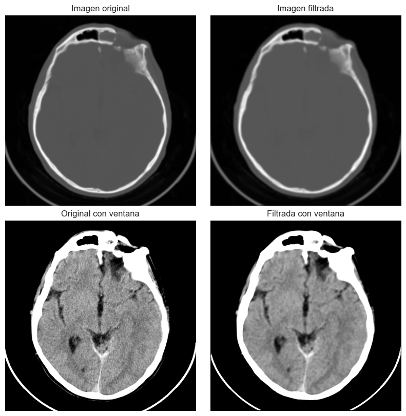
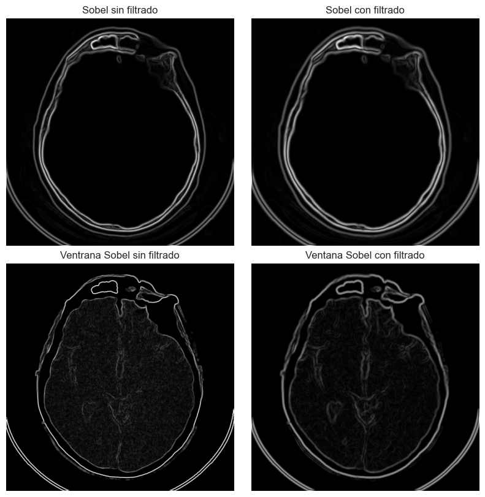
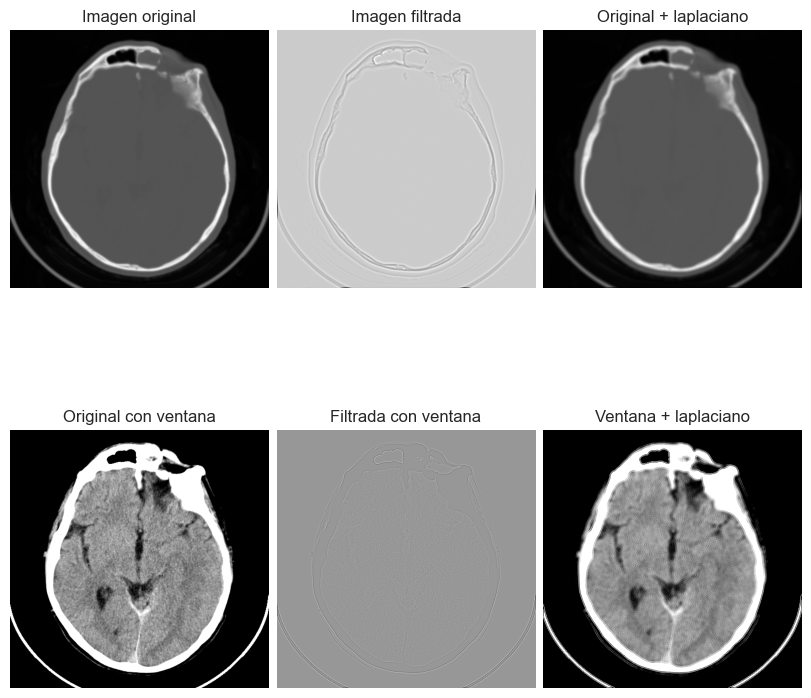
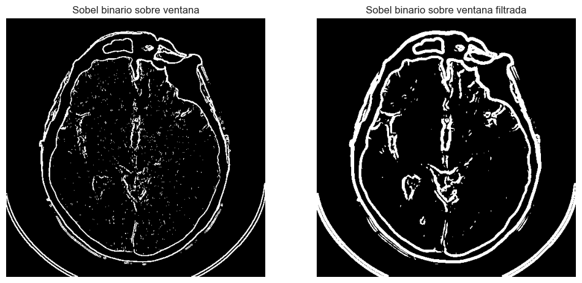

# 🧠 Filtrado Espacial de Imágenes Biomédicas con Python

Este proyecto aplica una serie de filtros espaciales clásicos sobre una imagen médica DICOM para mejorar su visualización o para detectar bordes y estructuras anatómicas de interés.

## 🧾 Descripción del Proyecto

La práctica se centra en comparar diferentes filtros espaciales aplicados a una imagen de tomografía computarizada (TC) craneal. El objetivo es evaluar cuáles de ellos permiten resaltar mejor las estructuras de interés, principalmente el tejido encefálico y el cráneo.

## ⚙️ Tecnologías y Librerías

- `numpy`: operaciones con arrays.
- `matplotlib`: visualización de imágenes y resultados.
- `pydicom`: lectura de imágenes médicas en formato DICOM.
- `cv2` (OpenCV): filtrado avanzado (Sobel, Canny, LoG).

## 📸 Procesamiento Realizado

### 1. Filtro paso bajo 5x5

Se suaviza la imagen reduciendo el ruido. Efectivo en imágenes con detalles suaves, especialmente sobre la **ventana de tejido blando**.

### 2. Filtro de Sobel

Detecta bordes mediante el gradiente en dirección X e Y. Resalta claramente el contorno del cráneo y senos paranasales.

📌 Resultado destacado sobre la ventana filtrada.

### 3. Filtro de Prewitt

Similar al de Sobel, con una ligera variación en el kernel. El resultado es casi idéntico al anterior, con pequeñas diferencias en el contorno de los bordes.

### 4. Filtro gaussiano

Suavizado más refinado que el paso bajo. Mejora la visualización sin perder tanto detalle. El filtro ideal para **preservar estructuras** mientras se reduce el ruido.

### 5. Filtro laplaciano

Detecta la segunda derivada. Altamente sensible al ruido. Aumenta el detalle fino, pero introduce distorsiones si no se prefiltra la imagen.

### 6. Filtro LoG (Laplaciano de Gaussiana)

Combina suavizado y detección de bordes. Mejora respecto al laplaciano puro. Resultado útil, aunque no aporta mucha mejora adicional sobre la imagen original.

### 7. Binarización por gradiente

Se realiza detección de bordes sobre la ventana filtrada:

- **Sobel + Umbralización**: probados varios umbrales. Mejores resultados en la ventana filtrada.
- **Canny**: buena detección, pero pierde algunas estructuras y presenta bordes no cerrados.

## ✅ Conclusión

Se concluye que:

- 🔍 **Sobel** es el mejor filtro de detección de bordes, especialmente sobre la **ventana filtrada**.
- 🎯 **Gaussiano** es el filtro de suavizado más eficaz para resaltar estructuras sin sacrificar contraste.
- 🧪 La elección del filtro óptimo depende de la región anatómica y el tipo de detalle que se desea realzar.

